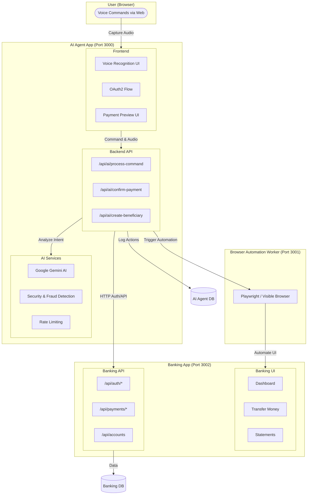
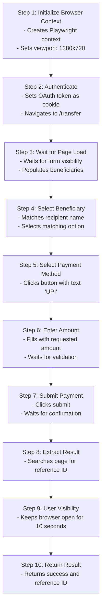

# VoxPe AI - Voice-First Banking Assistant

A comprehensive, production-ready voice-controlled banking system where an AI assistant can interact with a banking application through browser automation, while maintaining strict security and safety protocols. The system demonstrates how AI can safely handle financial operations with explicit user consent and complete transparency.

## Table of Contents

- [Overview](#overview)
- [System Architecture](#system-architecture)
- [Core Features & Security](#core-features--security)
  - [Voice Biometrics](#voice-biometrics)
  - [Liveness Detection](#liveness-detection)
  - [Multi-Layer Security](#multi-layer-security)
- [Browser Automation Logic](#browser-automation-logic)
- [Setup & Installation](#setup--installation)
- [Usage Guide](#usage-guide)
- [Development](#development)

---

## Overview

VoxPe AI is a sophisticated banking assistant that allows users to perform banking operations using natural voice commands. The system consists of three main components:

1. **AI Agent App** - A voice-first interface that processes user commands using AI.
2. **Banking App (Dummy Bank)** - A realistic banking web application with full banking features.
3. **Browser Automation Worker** - A Playwright-based service that automates browser interactions.

### Key Features

- 🎤 **Voice-First Interface** - Natural language voice commands for banking.
- 🛡️ **Voice Biometrics** - Secure enrollment and verification using unique vocal signatures.
- 🧬 **Liveness Detection** - Advanced spectral analysis to prevent replay attacks.
- 🔐 **PIN Security** - Multi-layer protection with account-linked PINs.
- 🤖 **AI-Powered** - Uses Google Gemini AI for intent parsing and command understanding.
- 🌐 **Browser Automation** - Automates banking operations through a visible browser window for transparency.
- ⚡ **Two-Phase Payment Flow** - Preview → Confirm → Execute with explicit consent.
- 💡 **Bill Payments** - Pay electricity bills, mobile recharges, and more via voice.

---

## System Architecture



---

## Core Features & Security

### Voice Biometrics

VoxPe implements advanced biometric security to reduce friction while maintaining high safety standards.

- **Enrollment**: Users read a mandatory security sentence to generate a unique vocal embedding.
- **Verification**: Uses **Cosine Similarity** (Threshold: `0.85`) to compare live commands against the stored profile.
- **Frictionless Flow**: If the voice matches, the security PIN is automatically skipped for the current transaction.
- **Rotation Policy**: Voice signatures automatically expire every **90 days**, requiring re-enrollment to maintain accuracy.
- **Re-enrollment Security**: Any attempt to update or re-enroll a voice profile requires verification via the **4-digit Security PIN**.

### Liveness Detection

To prevent replay attacks (recordings played into the mic), the system performs real-time **Spectral Flatness** analysis.
- **Live Voice**: Dynamic frequency spectrum with high variance.
- **Recorded Voice**: Flatter, less dynamic spectrum.
- **Rejection**: Commands with a flatness score below `0.01` are instantly blocked.

### Multi-Layer Security

1. **Account-Linked PINs**: Every bank account is protected by a unique 4-digit PIN (hashed with `bcrypt`).
2. **Two-Phase Confirmation**: AI creates a preview; the user must explicitly click "Confirm" before any execution.
3. **Idempotency**: All payment executions are idempotent, preventing accidental double-deductions.
4. **Fraud Detection**: Amount thresholds (₹50,000 limit) and frequency analysis block suspicious activity.
5. **Audit Logging**: Every AI action is logged with a unique Trace ID for full accountability.

---

## Browser Automation Logic

VoxPe AI uses Playwright to perform banking operations. This ensures that every action is visible and verifiable by the user.



---

## Setup & Installation

### Step 1: Install Dependencies

```bash
# Install all project dependencies
npm install

# Install Playwright browsers for the worker
npx playwright install chromium
```

### Step 2: Database Setup

The project uses two separate PostgreSQL databases (e.g., Neon).

```bash
# Banking database
cd packages/db-banking
export DATABASE_URL="your-banking-db-url"
npm run db:generate
npm run db:push

# AI agent database
cd ../db-ai
export DATABASE_URL="your-ai-db-url"
npm run db:generate
npm run db:push
```

### Step 3: Run Services

```bash
# Terminal 1: Banking App (Port 3002)
npm run dev:bank

# Terminal 2: AI Agent App (Port 3000)
npm run dev:ai

# Terminal 3: Browser Automation Worker (Port 3001)
npm run dev:worker
```

---

## Usage Guide

1. **Register**: Go to `http://localhost:3002/register` and create an account.
2. **Add Beneficiary**: Login to the bank and add at least one recipient (UPI or Account).
3. **Authorize**: Go to `http://localhost:3000` and click **"Securely Connect Banking App"**.
4. **Speak**: Click the mic and say: *"Pay 500 rupees to Rohan via UPI"* or *"What's my balance?"*.
5. **Verify**: Review the AI's preview and click **"Confirm Payment"** to watch the automation execute.

---

## Development

- **Frontend**: Next.js 14, TypeScript, Tailwind CSS
- **Backend**: Next.js API Routes, Express.js
- **Automation**: Playwright (Chromium)
- **AI**: Google Gemini AI (Gemini 2.5 Flash)
- **Voice**: WebKit Speech Recognition API

**Built with ❤️ for safe, transparent AI-powered banking.**
